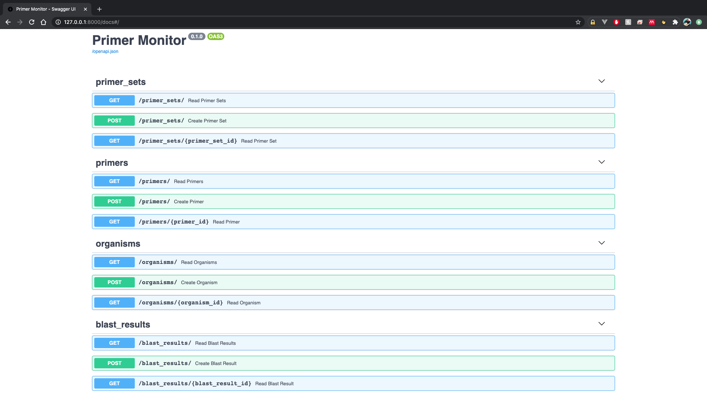
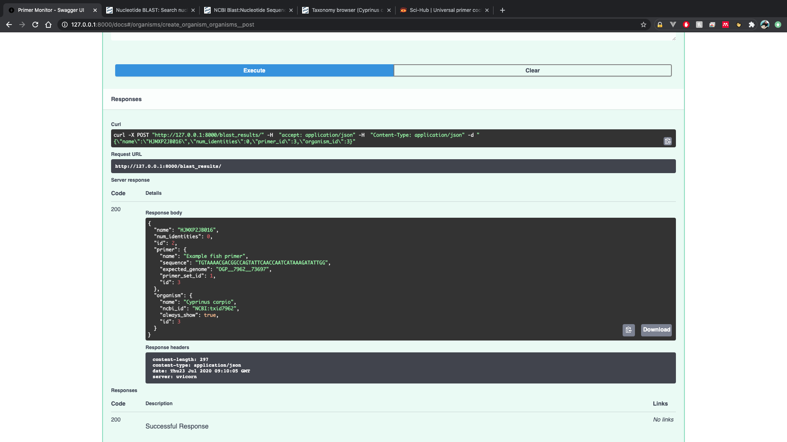

# primer monitor api 

This is an restful CRUD api for primer monitor built with FastAPI https://fastapi.tiangolo.com/

# set up
install dependencies with pipenv

`pipenv install`

# running

`uvicorn primer_monitor_api.main:app --reload`

Go to [http://127.0.0.1:8000](http://127.0.0.1:8000)

Swagger UI can be found at [/docs](http://127.0.0.1:8000/docs)

# Swagger

